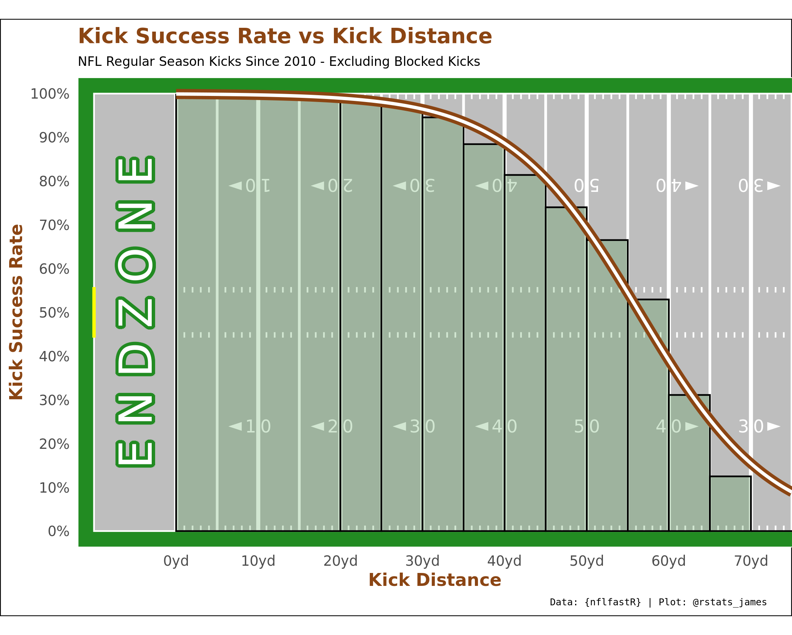

### nflKicks

A repo to host my code looking at success rates of NFL kicks.

Utilizing the wonderful [nflfastR](https://www.nflfastr.com/) package.

Though I didn't reuse any code, I did take inspiration from Marschall Furman's work with [gg_field](https://github.com/mlfurman3/gg_field) for my football field visuals. Thanks Marschall!

